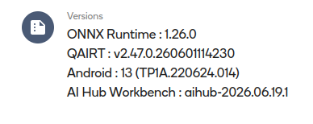
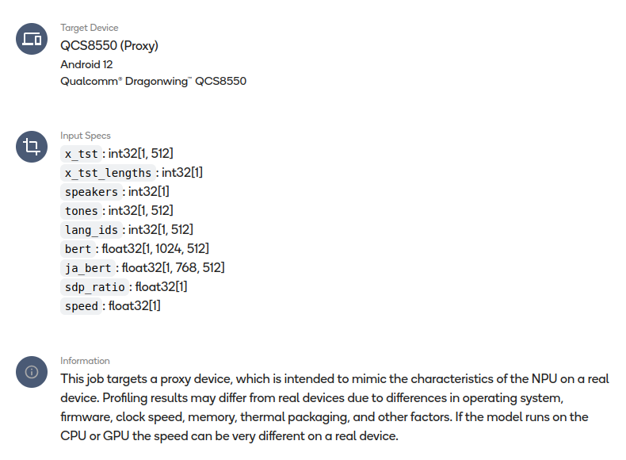
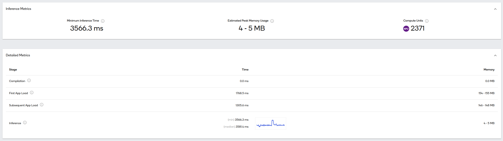

[EN](./README.en.md) | [ZH](./README.md)

## MeloTTS-ONNX Project Details


### 1. Project Overview

**MeloTTS-ONNX** is the ONNX inference version of [MeloTTS](https://github.com/MoonshotAI/MeloTTS), specifically optimized for **CPU real-time inference**. The project supports:

- ✅ Chinese-English mixed TTS
- ✅ Multiple languages: Chinese, English, Japanese, Korean, Spanish, French, etc.
- ✅ ONNX Runtime inference, fast inference speed
- ✅ Static & Dynamic ONNX model export
- ✅ QNN Execution Provider for Qualcomm HTP deployment
- ✅ Chunked inference for long text with adaptive silence trimming

---

#### Repository Links

- Gitee: https://gitee.com/jackroing/melo-tts-onnx.git
- GitHub: https://github.com/201831771214/MeloTTS-ONNX.git
- ModelScope Model: https://www.modelscope.cn/models/KeanuX/MeloTTS-ZH-MIXED-EN-ONNX

```shell
# Clone via Gitee
git clone https://gitee.com/jackroing/melo-tts-onnx.git

# Clone via GitHub
git clone https://github.com/201831771214/MeloTTS-ONNX.git

# Download model
modelscope download --model KeanuX/MeloTTS-ZH-MIXED-EN-ONNX --local_dir ./
```

### 2. Project Architecture

```
melo-tts-onnx/
├── melo/                      # Original PyTorch training code
│   ├── api.py                 # TTS API interface
│   ├── models.py              # Model definition (SynthesizerTrn)
│   ├── modules.py             # Model modules
│   ├── text/                  # Text processing (tokenization, phoneme conversion)
│   │   ├── chinese.py         # Chinese text processing
│   │   ├── english.py         # English text processing
│   │   └── ...
│   ├── train.py / train.sh    # Training scripts
│   └── ...
│
├── melo_extra/                # Text processing modules required for inference
│   ├── melo_tts.py            # ONNX export wrapper
│   └── inference/
│       ├── text/              # Inference text processing (corresponds to melo/text)
│       ├── commons.py         # Common utilities
│       └── utils.py           # Parameter configuration
│
├── models/melotts/            # ONNX model directory
│   ├── melotts_14.onnx        # Exported ONNX model
│   ├── config.json            # Model configuration
│   └── bert-base-multilingual-uncased/  # BERT model
│
├── run_onnx.py                # ⭐ Core inference script
├── export_melo.py             # ONNX export script
├── export_model_info.py       # Model information export tool
└── README.md
```

---

### 3. Core Script Usage

#### 3.1 Inference Script: `run_onnx.py`

This is the **most commonly used script** for converting text to speech:

```python
from run_onnx import MeloTTS

# Initialize the model
model_path = "./models/MeloTTS-ZH-MIXED-EN-ONNX/"
melo_tts = MeloTTS(model_path, device="cpu")

# Generate audio (dynamic model)
audio, sr = melo_tts.generate_audio(
    text="你好，我是中英混合模型。Hello I am a mixed language model.",
    language="ZH_MIX_EN",      # Language: ZH_MIX_EN, EN, JP, KR etc.
    sdp_ratio=0.2,            # SDP ratio
    noise_scale=0.667,        # Noise scale
    noise_scale_w=0.8,        # Noise weight
    speed=1.0                 # Speech speed
)

# Or use chunked inference (static model)
audio, sr = melo_tts.generate_audio_chunked(
    text="你好，我是中英混合模型。Hello I am a mixed language model.",
    language="ZH_MIX_EN",
    sdp_ratio=0.2,
    noise_scale_w=0.8,
    speed=1.0,
    chunk_size=512            # Must match the model's sequence length
)
```

**Main Parameter Description:**

| Parameter | Description | Default |
|------|------|--------|
| `text` | Input text | Required |
| `language` | Language code | `"ZH_MIX_EN"` |
| `sdp_ratio` | SDP ratio (0-1) | 0.2 |
| `noise_scale` | Noise scale | 0.667 |
| `noise_scale_w` | Noise weight | 0.8 |
| `speed` | Speech speed | 1.0 |
| `chunk_size` | Chunk size for static model | 512 |

**Supported Language Codes:**

- `ZH_MIX_EN` - Chinese (supports Chinese-English mixing)
- `EN` - English
- `JP` - Japanese
- `KR` - Korean
- etc.

**Command Line Usage:**

```bash
# Dynamic model
python run_onnx.py -d cuda -i -t "你好，我是中英混合模型。Hello I am a mixed language model." -l ZH_MIX_EN

# Static model (auto-detects from model directory)
python run_onnx.py -d cuda -t "你好，我是中英混合模型。Hello I am a mixed language model." -l ZH_MIX_EN
```

---

#### 3.2 ONNX Export Script: `export_melo.py`

Used to export PyTorch models to ONNX format:

```bash
# Export dynamic model (default)
python export_melo.py \
    -m /path/to/ckpt \
    -c /path/to/config.json \
    -o /path/to/save_dir \
    --opset 14

# Export static model with sequence_length=512 and reduced mel frames
python export_melo.py \
    -m /path/to/ckpt \
    -c /path/to/config.json \
    -o /path/to/save_dir \
    --opset 14 \
    -sl 512 \
    -mmf 1024
```

**Main Parameters:**

| Parameter | Description | Default |
|------|------|--------|
| `-m / --ckpt_path` | Model checkpoint path | `./models/MeloTTS-Chinese/checkpoint.pth` |
| `-c / --cfg_path` | Configuration file path | `./models/MeloTTS-Chinese/config.json` |
| `-o / --output_path` | Output directory | `./models/` |
| `--opset` | ONNX opset version | 14 |
| `-id / --is_dynamic` | Export with dynamic axes | disabled |
| `-t / --test_txt` | Test text for dummy input | (Chinese text) |
| `-sl / --seq_len` | Target text sequence length (pads/truncates) | None |
| `-mmf / --max_mel_frames` | Max mel-spectrogram frames (lower = less memory) | 1024 |
| `-sr / --sdp_ratio` | SDP ratio | 0.5 |
| `-ns / --noise_scale` | Noise scale | 0.667 |
| `-sp / --speed` | Speed | 1.0 |

---

#### 3.3 Model Information Export: `export_model_info.py`

Used to export detailed information about the ONNX model (input/output shapes, parameter count, etc.):

```bash
python export_model_info.py -m ./models/melotts_onnx/melotts_14_dynamic.onnx -o ./infos/melotts_14.info
```

Output Example:

```text
============================================================
ONNX Model Basic Information
============================================================
Model File Path: ./models/melotts_onnx/melotts_14_dynamic.onnx
ONNX Version: 7
Producer Info: pytorch 2.8.0
Model Version: 0

============================================================
Model Input Information (Total 11 Inputs)
============================================================
Input 1: x_tst          Data Type: int32     Shape: [0, 0]
Input 2: x_tst_lengths  Data Type: int32     Shape: [0]
Input 3: speakers       Data Type: int32     Shape: [0]
Input 4: tones          Data Type: int32     Shape: [0, 0]
Input 5: lang_ids       Data Type: int32     Shape: [0, 0]
Input 6: bert           Data Type: float32   Shape: [0, 1024, 0]
Input 7: ja_bert        Data Type: float32   Shape: [0, 768, 0]
Input 8: sdp_ratio      Data Type: float32   Shape: [0]
Input 9: noise_scale    Data Type: float32   Shape: [0]
Input 10: noise_scale_w Data Type: float32   Shape: [0]
Input 11: speed         Data Type: float32   Shape: [0]

============================================================
Model Output Information (Total 1 Output)
============================================================
Output 1: audio_data    Data Type: float32   Shape: [1, 0]

============================================================
ONNX Model Basic Information
============================================================
Model File Path: ./models/melotts_onnx/melotts_14_static.onnx
...

============================================================
Model Input Information (Total 10 Inputs)
============================================================
Input 1: x_tst          Data Type: int32     Shape: [1, 512]
Input 2: x_tst_lengths  Data Type: int32     Shape: [1]
Input 3: speakers       Data Type: int32     Shape: [1]
Input 4: tones          Data Type: int32     Shape: [1, 512]
Input 5: lang_ids       Data Type: int32     Shape: [1, 512]
Input 6: bert           Data Type: float32   Shape: [1, 1024, 512]
Input 7: ja_bert        Data Type: float32   Shape: [1, 768, 512]
Input 8: sdp_ratio      Data Type: float32   Shape: [1]
Input 9: noise_scale_w  Data Type: float32   Shape: [1]
Input 10: speed         Data Type: float32   Shape: [1]

============================================================
QNN Precompiled Model Information
============================================================
...
Output 1: audio_data    Data Type: float32   Shape: [1, 429568]
...
Operator Type           | Count
------------------------------
EPContext               | 1
```

#### Update Information

MeloTTS ONNX Static Model Updates:
- Increased sequence length from 239 → 512
- Reduced intermediate layer parameters to half (max_mel_frames: 2048 → 1024)
- Added adaptive silence trimming for precise audio output

#### Precompiled QNN ONNX Profile Info





---

### 4. How It Works

```
Text Input
   ↓
┌─────────────────────────────────────────┐
│  Text Preprocessing (clean_text)        │
│  - Tokenization                         │
│  - Convert to phoneme                    │
│  - Get tone                              │
│  - BERT Feature Extraction               │
└─────────────────────────────────────────┘
   ↓
┌─────────────────────────────────────────┐
│  ONNX Model Inference                    │
│  - Glow-TTS (Text → Mel Spectrogram)    │
│  - HiFi-GAN (Mel Spectrogram → Audio)   │
└─────────────────────────────────────────┘
   ↓
Audio Output (44.1kHz)
```

**ONNX Dynamic Model Inputs (11):**

1. `x_tst` - Text token IDs
2. `x_tst_lengths` - Text length
3. `speakers` - Speaker ID
4. `tones` - Tone IDs
5. `lang_ids` - Language IDs
6. `bert` - BERT features (1024-dim)
7. `ja_bert` - Japanese BERT features (768-dim)
8. `sdp_ratio` - SDP ratio
9. `noise_scale` - Noise scale
10. `noise_scale_w` - Noise weight
11. `speed` - Speech speed

**ONNX Model Output (1):**

- `audio_data` - Generated audio data

---

**ONNX Static Model Inputs (10):** (no `noise_scale`; shapes are frozen)

1. `x_tst` - Text token IDs (shape: [1, 512])
2. `x_tst_lengths` - Text length
3. `speakers` - Speaker ID
4. `tones` - Tone IDs
5. `lang_ids` - Language IDs
6. `bert` - BERT features (1024-dim)
7. `ja_bert` - Japanese BERT features (768-dim)
8. `sdp_ratio` - SDP ratio
9. `noise_scale_w` - Noise weight
10. `speed` - Speech speed

**ONNX Model Output (1):**

- `audio_data` - Generated audio data

---

#### Note:

- Dynamic models support variable-length input (no padding needed), suitable for CPU/CUDA deployment.
- Static models require fixed-length input (padded to 512 tokens), producing fixed-length output that is trimmed by RMS-based silence detection. Suitable for QNN HTP deployment.
- For static models, set `chunk_size` equal to the model's sequence length (512). If input exceeds this, it will be automatically split into multiple chunks, and audio segments concatenated.

---

### 5. Quick Usage Example

```python
"""MeloTTS ONNX Runtime Inference

Static ONNX Model Inference:
    ============================================================
    Model Input Information (Total 10 Inputs)
    ============================================================
    Input 1: x_tst          Data Type: int32     Shape: [1, 512]
    Input 2: x_tst_lengths  Data Type: int32     Shape: [1]
    Input 3: speakers       Data Type: int32     Shape: [1]
    Input 4: tones          Data Type: int32     Shape: [1, 512]
    Input 5: lang_ids       Data Type: int32     Shape: [1, 512]
    Input 6: bert           Data Type: float32   Shape: [1, 1024, 512]
    Input 7: ja_bert        Data Type: float32   Shape: [1, 768, 512]
    Input 8: sdp_ratio      Data Type: float32   Shape: [1]
    Input 9: noise_scale_w  Data Type: float32   Shape: [1]
    Input 10: speed         Data Type: float32   Shape: [1]

Dynamic ONNX Model Inference:
    ============================================================
    Model Input Information (Total 11 Inputs)
    ============================================================
    Input 1: x_tst          Data Type: int32     Shape: [0, 0]
    Input 2: x_tst_lengths  Data Type: int32     Shape: [0]
    Input 3: speakers       Data Type: int32     Shape: [0]
    Input 4: tones          Data Type: int32     Shape: [0, 0]
    Input 5: lang_ids       Data Type: int32     Shape: [0, 0]
    Input 6: bert           Data Type: float32   Shape: [0, 1024, 0]
    Input 7: ja_bert        Data Type: float32   Shape: [0, 768, 0]
    Input 8: sdp_ratio      Data Type: float32   Shape: [0]
    Input 9: noise_scale    Data Type: float32   Shape: [0]
    Input 10: noise_scale_w Data Type: float32   Shape: [0]
    Input 11: speed         Data Type: float32   Shape: [0]

QNN ONNX Model Inference:
    ============================================================
    Model Input Information (Total 10 Inputs)
    ============================================================
    Input 1: x_tst          Data Type: int32     Shape: [1, 512]
    Input 2: x_tst_lengths  Data Type: int32     Shape: [1]
    Input 3: speakers       Data Type: int32     Shape: [1]
    Input 4: tones          Data Type: int32     Shape: [1, 512]
    Input 5: lang_ids       Data Type: int32     Shape: [1, 512]
    Input 6: bert           Data Type: float32   Shape: [1, 1024, 512]
    Input 7: ja_bert        Data Type: float32   Shape: [1, 768, 512]
    Input 8: sdp_ratio      Data Type: float32   Shape: [1]
    Input 9: noise_scale_w  Data Type: float32   Shape: [1]
    Input 10: speed         Data Type: float32   Shape: [1]
"""


import onnxruntime as ort
import numpy as np
import os
import sys
import soundfile as sf
from typing import Tuple
from melo_extra.inference.utils import HParams, get_hparams_from_file
from melo_extra.inference.text.cleaner import clean_text
from melo_extra.inference.text import cleaned_text_to_sequence, get_bert, get_zh_mix_en_bert
from melo_extra.inference import commons
import argparse
import logging

logger = logging.getLogger(__name__)
file_handler = logging.FileHandler("./logs/run_melo_onnx.log", mode="w", encoding="utf-8")
formatter = logging.Formatter("%(asctime)s - %(levelname)s - %(message)s")
file_handler.setFormatter(formatter)
file_handler.setLevel(logging.INFO)
logger.addHandler(file_handler)
logger.setLevel(logging.INFO)

class MeloTTS:
    def __init__(self, model_root:str, device:str="cpu", provider_options:list[dict]=None, is_dynamic:bool=True) -> None:
        self.model_list = {}
        
        for f in os.listdir(model_root):
            if f.endswith(".onnx"):
                self.model_list[f] = os.path.join(model_root, f)
                logger.info(f"find model: {f}")
        
        if is_dynamic:
            for k, v in self.model_list.items():
                if "dynamic" in k.lower():
                    self.model_name = v
                    break
            else:
                self.model_name = None
        else:
            if device == "qnn":
                self.model_name = os.path.join(model_root, "precompiled_qnn_onnx", "model.onnx")
            else:
                for k, v in self.model_list.items():
                    if "static" in k.lower():
                        self.model_name = v
                        break
                else:
                    self.model_name = None
        
        if self.model_name is None:
            logger.error(f"model not found in: {model_root}")
            sys.exit(1)
        
        logger.info(f"Use model: {self.model_name}")
        self.model_path = self.model_name
        self.cfg_path = os.path.join(model_root, "config.json")
        self.bert_model_path = os.path.join(model_root, "bert-base-multilingual-uncased")
        
        self.cfg = get_hparams_from_file(self.cfg_path)
        self.sample_rate = self.cfg.data.sampling_rate
        
        if device == "cuda" and "CUDAExecutionProvider" in ort.get_available_providers():
            self.providers = ["CUDAExecutionProvider"]
        elif device == "cpu":
            self.providers = ["CPUExecutionProvider"]
        elif device == "qnn" and "QNNExecutionProvider" in ort.get_available_providers() and provider_options is not None:
            self.providers = ["QNNExecutionProvider"]
        else:
            logger.info(f"device {device} not supported, falling back to CPU")
            self.providers = ["CPUExecutionProvider"]
        
        self.provider_options = provider_options if self.providers == ["QNNExecutionProvider"] else None
        self.session = ort.InferenceSession(self.model_path, providers=self.providers, provider_options=provider_options)
        self.input_names = [i.name for i in self.session.get_inputs()]
        self.output_names = [o.name for o in self.session.get_outputs()]
    
    @staticmethod
    def _trim_trailing_silence(audio: np.ndarray) -> np.ndarray:
        """Trim trailing idle noise using RMS energy detection."""
        if len(audio) < 2048:
            return audio
        win = 512
        frame_rms = np.array([
            np.sqrt(np.mean(audio[i:i+win].astype(np.float64) ** 2))
            for i in range(0, len(audio) - win, win)
        ])
        tail_n = max(1, len(frame_rms) // 10)
        idle_rms = np.max(frame_rms[-tail_n:])
        threshold = max(idle_rms * 3, 5e-4)
        above = np.where(frame_rms > threshold)[0]
        if len(above) == 0:
            return audio[:0]
        cut_frame = above[-1] + 1
        cut_sample = min(cut_frame * win, len(audio))
        return audio[:cut_sample]

    def __preprocess(self, text:str, language:str):
        norm_text, phone, tone, word2ph = clean_text(text, language)
        symbol_to_id = {s: i for i, s in enumerate(self.cfg.symbols)}
        phone, tone, language = cleaned_text_to_sequence(phone, tone, language, symbol_to_id)
        
        if self.cfg.data.add_blank:
            phone = commons.intersperse(phone, 0)
            tone = commons.intersperse(tone, 0)
            language = commons.intersperse(language, 0)
            for i in range(len(word2ph)):
                word2ph[i] = word2ph[i] * 2
            word2ph[0] += 1
        
        if getattr(self.cfg.data, "disable_bert", True):
            bert = np.zeros((1024, len(phone)), dtype=np.float32)
            ja_bert = np.zeros((768, len(phone)), dtype=np.float32)
        else:
            bert = get_zh_mix_en_bert(self.bert_model_path, text, word2ph, "cpu")
            del word2ph
            if language == "ZH":
                ja_bert = np.zeros((768, len(phone)), dtype=np.float32)
            else:
                ja_bert = bert
                bert = np.zeros((1024, len(phone)), dtype=np.float32)
        
        return (
            np.expand_dims(np.array(phone, dtype=np.int32), 0),
            np.array([len(phone)], dtype=np.int32),
            np.array([1], dtype=np.int32),
            np.expand_dims(np.array(tone, dtype=np.int32), 0),
            np.expand_dims(np.array(language, dtype=np.int32), 0),
            np.expand_dims(bert, 0),
            np.expand_dims(ja_bert, 0),
        )
    
    def generate_audio_chunked(self, text, language="ZH_MIX_EN", sdp_ratio=0.2,
                               noise_scale_w=0.8, speed=1.0, chunk_size=512):
        x_tst, x_tst_lengths, speaker_id, tones, lang_ids, bert, ja_bert = self.__preprocess(text, language)
        total_len = x_tst_lengths[0]
        num_part = total_len // chunk_size + (1 if total_len % chunk_size != 0 else 0)
        
        audio_seg = []
        for part in range(num_part):
            start = part * chunk_size
            end = min((part + 1) * chunk_size, total_len)
            actual_len = end - start
            pad_len = chunk_size - actual_len
            
            x_tst_part   = x_tst[:, start:end]
            tone_part     = tones[:, start:end]
            lang_ids_part = lang_ids[:, start:end]
            bert_part     = bert[:, :, start:end]
            ja_bert_part  = ja_bert[:, :, start:end]
            
            if pad_len > 0:
                x_tst_part   = np.pad(x_tst_part,   ((0,0),(0,pad_len)))
                tone_part     = np.pad(tone_part,     ((0,0),(0,pad_len)))
                lang_ids_part = np.pad(lang_ids_part, ((0,0),(0,pad_len)))
                bert_part     = np.pad(bert_part,     ((0,0),(0,0),(0,pad_len)))
                ja_bert_part  = np.pad(ja_bert_part,  ((0,0),(0,0),(0,pad_len)))
            
            x_tst_lengths_part = np.array([actual_len], dtype=np.int32)
            
            input_spec = {
                self.input_names[0]: x_tst_part,
                self.input_names[1]: x_tst_lengths_part,
                self.input_names[2]: speaker_id,
                self.input_names[3]: tone_part,
                self.input_names[4]: lang_ids_part,
                self.input_names[5]: bert_part,
                self.input_names[6]: ja_bert_part,
                self.input_names[7]: np.array([sdp_ratio], dtype=np.float32),
                self.input_names[8]: np.array([noise_scale_w], dtype=np.float32),
                self.input_names[9]: np.array([speed], dtype=np.float32),
            }
            
            output = self.session.run(self.output_names, input_spec)[0]
            audio_full = np.squeeze(output, axis=0)
            audio_full = self._trim_trailing_silence(audio_full)
            audio_seg.append(audio_full)
        
        return np.concatenate(audio_seg, axis=0), self.sample_rate
    
    def generate_audio(self, text, language="ZH_MIX_EN", sdp_ratio=0.2,
                       noise_scale=0.667, noise_scale_w=0.8, speed=1.0):
        x_tst, x_tst_lengths, speaker_id, tones, lang_ids, bert, ja_bert = self.__preprocess(text, language)
        
        input_spec = {
            self.input_names[0]: x_tst,
            self.input_names[1]: x_tst_lengths,
            self.input_names[2]: speaker_id,
            self.input_names[3]: tones,
            self.input_names[4]: lang_ids,
            self.input_names[5]: bert,
            self.input_names[6]: ja_bert,
            self.input_names[7]: np.array([sdp_ratio], dtype=np.float32),
            self.input_names[8]: np.array([noise_scale], dtype=np.float32),
            self.input_names[9]: np.array([noise_scale_w], dtype=np.float32),
            self.input_names[10]: np.array([speed], dtype=np.float32),
        }
        
        output = self.session.run(self.output_names, input_spec)[0]
        return np.squeeze(output, axis=0), self.sample_rate


if __name__ == "__main__":
    parser = argparse.ArgumentParser(description="Run MeloTTS ONNX Inference")
    parser.add_argument("-m", "--model_path", default="./models/MeloTTS-ZH-MIXED-EN-ONNX/")
    parser.add_argument("-o", "--output_path", default="./")
    parser.add_argument("-d", "--device", default="cpu")
    parser.add_argument("-i", "--is_dynamic", action="store_true")
    parser.add_argument("-t", "--text", default="我们正式推出大语言模型。")
    parser.add_argument("-l", "--language", default="ZH_MIX_EN")
    parser.add_argument("-sdp", "--sdp_ratio", type=float, default=0.2)
    parser.add_argument("-ns", "--noise_scale", type=float, default=0.667)
    parser.add_argument("-nsw", "--noise_scale_w", type=float, default=0.8)
    parser.add_argument("-s", "--speed", type=float, default=1.0)
    args = parser.parse_args()
    
    provider_options = None
    if args.device == "qnn":
        provider_options = [{
            'backend_path': f'{os.environ["QNN_SDK_ROOT"]}/lib/aarch64-oe-linux-gcc11.2/libQnnHtp.so',
        }]
    
    melo_tts = MeloTTS(args.model_path, args.device, provider_options, args.is_dynamic)
    
    if args.is_dynamic:
        audio, sr = melo_tts.generate_audio(args.text, args.language,
                                            args.sdp_ratio, args.noise_scale,
                                            args.noise_scale_w, args.speed)
    else:
        audio, sr = melo_tts.generate_audio_chunked(args.text, args.language,
                                                    args.sdp_ratio, args.noise_scale_w,
                                                    args.speed, chunk_size=512)
    
    save_path = os.path.join(args.output_path, "dynamic_output.wav" if args.is_dynamic else "static_output.wav")
    os.makedirs(args.output_path, exist_ok=True)
    sf.write(save_path, audio, sr)
```

---

#### Acknowledgements

- This project is based on the [MeloTTS](https://github.com/myshell-ai/MeloTTS) project.
- Model conversion uses the [ONNX](https://onnx.ai/) framework.
- Inference uses the [ONNX Runtime](https://onnxruntime.ai/) framework.

#### Contact

- WeChat Official Account: "CrazyNET"
