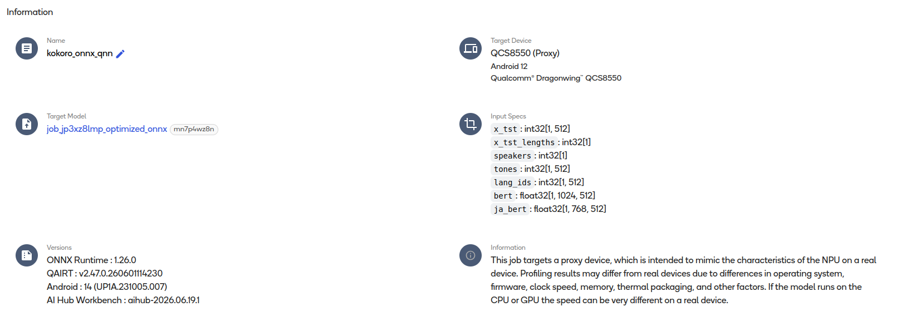
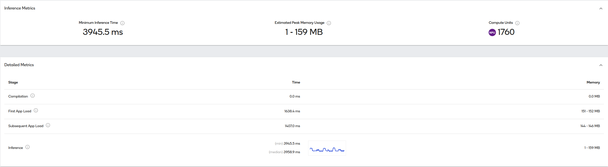

## MeloTTS-ONNX 项目详解


### 1. 项目概述

**MeloTTS-ONNX** 是 [MeloTTS](https://github.com/MoonshotAI/MeloTTS) 的 ONNX 推理版本，专门针对 **CPU 实时推理**进行了优化。项目支持：

- ✅ 中英文混合 TTS
- ✅ 多种语言：中文、英文、日文、韩文、西班牙语、法语等
- ✅ ONNX Runtime 推理，推理速度快

---

#### 仓库地址

- Gitee仓库: https://gitee.com/jackroing/melo-tts-onnx.git
- GitHub仓库: https://github.com/201831771214/MeloTTS-ONNX.git
- ModelScope模型仓库: https://www.modelscope.cn/models/KeanuX/MeloTTS-ZH-MIXED-EN-ONNX

```shell
# gitee克隆仓库
git clone https://gitee.com/jackroing/melo-tts-onnx.git

# github克隆仓库
git clone https://github.com/201831771214/MeloTTS-ONNX.git

# 获取模型
modelscope download --model KeanuX/MeloTTS-ZH-MIXED-EN-ONNX --local_dir ./
```

### 2. 项目架构

```
melo-tts-onnx/
├── melo/                      # 原始 PyTorch 训练代码
│   ├── api.py                 # TTS API 接口
│   ├── models.py              # 模型定义 (SynthesizerTrn)
│   ├── modules.py             # 模型模块
│   ├── text/                  # 文本处理（分词、phoneme转换）
│   │   ├── chinese.py         # 中文文本处理
│   │   ├── english.py         # 英文文本处理
│   │   └── ...
│   ├── train.py / train.sh    # 训练脚本
│   └── ...
│
├── melo_extra/                # 推理时依赖的文本处理模块
│   ├── melo_tts.py            # ONNX 导出封装
│   └── inference/
│       ├── text/              # 推理用文本处理（与melo/text对应）
│       ├── commons.py         # 通用工具
│       └── utils.py           # 参数配置
│
├── models/melotts/            # ONNX 模型目录
│   ├── melotts_14.onnx        # 导出的 ONNX 模型
│   ├── config.json            # 模型配置
│   └── bert-base-multilingual-uncased/  # BERT 模型
│
├── run_onnx.py                # ⭐ 核心推理脚本
├── export_melo.py             # ONNX 导出脚本
├── export_model_info.py       # 模型信息导出工具
└── README.md
```

---

### 3. 核心脚本使用

#### 3.1 推理脚本：`run_onnx.py`

这是**最常用的脚本**，用于将文本转换为语音：

```python
from run_onnx import MeloTTS

# 初始化模型
model_path = "./models/melotts/"
melo_tts = MeloTTS(model_path, device="cpu")

# 生成音频
audio, sr = melo_tts.generate_audio(
    text="你好，我是中英混合模型。Hello I am a mixed language model.",
    language="ZH_MIX_EN",      # 语言: ZH_MIX_EN, EN, JP, KR 等
    sdp_ratio=0.2,            # SDP 比率
    noise_scale=0.667,        # 噪声尺度
    noise_scale_w=0.8,        # 噪声权重
    speed=1.0                 # 语速
)
```

**主要参数说明：**

| 参数 | 说明 | 默认值 |
|------|------|--------|
| `text` | 输入文本 | 必填 |
| `language` | 语言代码 | `"ZH_MIX_EN"` |
| `sdp_ratio` | SDP 比率 (0-1) | 0.2 |
| `noise_scale` | 噪声尺度 | 0.667 |
| `noise_scale_w` | 噪声权重 | 0.8 |
| `speed` | 语速 | 1.0 |

**支持的语言代码：**

- `ZH_MIX_EN` - 中文（支持中英文混合）
- `EN` - 英文
- 等

---

#### 3.2 ONNX 导出脚本：`export_melo.py`

用于将 PyTorch 模型导出为 ONNX 格式：

```bash
python export_melo.py \
    -m /path/to/ckpt \
    -c /path/to/config.json \
    -o /path/to/save_dir \
    --opset 14
    ...
```

**主要参数：**

- `--ckpt_path` - 模型检查点路径
- `--cfg_path` - 配置文件路径
- `--output_path` - 输出 ONNX 文件路径
- `--opset` - ONNX opset 版本（默认14）

---

#### 3.3 模型信息导出：`export_model_info.py`

用于导出 ONNX 模型的详细信息（输入输出形状、参数数量等）：

```bash
python export_model_info.py -m ./models/melotts/melotts_14.onnx -o ./infos/melotts_14.info
```

输出示例：

```text
============================================================
ONNX模型基本信息
============================================================
模型文件路径: ./models/melotts_onnx/melotts_14_dynamic.onnx
ONNX版本: 7
生产者信息: pytorch 2.8.0
模型版本: 0
描述: 

============================================================
模型输入信息 (共 11 个输入)
============================================================
Input 1: x_tst
  数据类型: int32
  形状: [0, 0]

Input 2: x_tst_lengths
  数据类型: int32
  形状: [0]

Input 3: speakers
  数据类型: int32
  形状: [0]

Input 4: tones
  数据类型: int32
  形状: [0, 0]

Input 5: lang_ids
  数据类型: int32
  形状: [0, 0]

Input 6: bert
  数据类型: float32
  形状: [0, 1024, 0]

Input 7: ja_bert
  数据类型: float32
  形状: [0, 768, 0]

Input 8: sdp_ratio
  数据类型: float32
  形状: [0]

Input 9: noise_scale
  数据类型: float32
  形状: [0]

Input 10: noise_scale_w
  数据类型: float32
  形状: [0]

Input 11: speed
  数据类型: float32
  形状: [0]

============================================================
模型输出信息 (共 1 个输出)
============================================================
Output 1: audio_data
  数据类型: float32
  形状: [1, 0]


============================================================
ONNX模型基本信息
============================================================
模型文件路径: ./models/melotts_onnx/melotts_14_static.onnx
ONNX版本: 7
生产者信息: pytorch 2.8.0
模型版本: 0
描述: 

============================================================
模型输入信息 (共 10 个输入)
============================================================
Input 1: x_tst
  数据类型: int32
  形状: [1, 239]

Input 2: x_tst_lengths
  数据类型: int32
  形状: [1]

Input 3: speakers
  数据类型: int32
  形状: [1]

Input 4: tones
  数据类型: int32
  形状: [1, 239]

Input 5: lang_ids
  数据类型: int32
  形状: [1, 239]

Input 6: bert
  数据类型: float32
  形状: [1, 1024, 239]

Input 7: ja_bert
  数据类型: float32
  形状: [1, 768, 239]

Input 8: sdp_ratio
  数据类型: float32
  形状: [1]

Input 9: noise_scale_w
  数据类型: float32
  形状: [1]

Input 10: speed
  数据类型: float32
  形状: [1]

============================================================
模型输出信息 (共 1 个输出)
============================================================
Output 1: audio_data
  数据类型: float32
  形状: [1, 0]

============================================================
ONNX模型基本信息
============================================================
模型文件路径: ./melo_tts_qnn/model.onnx
ONNX版本: 11
生产者信息: Qualcomm AI Hub Workbench aihub-2026.02.26.0
模型版本: 0
描述: 

============================================================
模型输入信息 (共 10 个输入)
============================================================
Input 1: x_tst
  数据类型: int32
  形状: [1, 239]

Input 2: x_tst_lengths
  数据类型: int32
  形状: [1]

Input 3: speakers
  数据类型: int32
  形状: [1]

Input 4: tones
  数据类型: int32
  形状: [1, 239]

Input 5: lang_ids
  数据类型: int32
  形状: [1, 239]

Input 6: bert
  数据类型: float32
  形状: [1, 1024, 239]

Input 7: ja_bert
  数据类型: float32
  形状: [1, 768, 239]

Input 8: sdp_ratio
  数据类型: float32
  形状: [1]

Input 9: noise_scale_w
  数据类型: float32
  形状: [1]

Input 10: speed
  数据类型: float32
  形状: [1]

============================================================
模型输出信息 (共 1 个输出)
============================================================
Output 1: audio_data
  数据类型: float32
  形状: [1, 429568]

============================================================
模型权重信息 (共 0 个参数)
============================================================
模型总参数量: 0

============================================================
模型运算符信息 (共 1 个运算符)
============================================================
运算符类型           | 使用次数
------------------------------
EPContext       | 1

详细层信息:
------------------------------------------------------------
层 1: QNNContext (EPContext)
  输入: x_tst, x_tst_lengths, speakers, tones, lang_ids, bert, ja_bert, sdp_ratio, noise_scale_w, speed
  输出: audio_data
  属性:
    - embed_mode: 
    - ep_cache_context: ./model.bin
    - source: QNN


============================================================
额外信息
============================================================
导入版本: -13
模型计算图名称: qnn-onnx-model
```

#### Update信息
更新MeloTTS ONNX Static Model:
- 增加melotts_14_static.onnx模型的序列长度到512,减少中间层参数量为原来的一半

#### Precompiled QNN ONNX Profile Info




#### 各位小伙伴在运行MeloTTS QNN ONNX EP的时候关闭如下输入即可：

```python
# generate_audio_chunked 或者 generate_audio中

named_inputs = {
    "x_tst": x_tst_part,
    "x_tst_lengths": x_tst_lengths_part,
    "speakers": speaker_id,
    "tones": tone_part,
    "lang_ids": lang_ids_part,
    "bert": bert_part,
    "ja_bert": ja_bert_part,
    "sdp_ratio": np_sdp_ratio,
    # "noise_scale": np_noise_scale,
    # "noise_scale_w": np_noise_scale_w,
    # "speed": np_speed,
}
```

- 原始MeloTTS源码中采用DP + SDP的方案保证音频质量并动态计算frames，但QNN HTP fp16下两个模块都会精度崩溃（encoder → duration predictor 链路累积误差 + exp 下溢）。我们直接绕过整个duration predictor，改用固定4帧/token方案，彻底规避fp16精度问题。详细QNN适配原理见 [UPDATE.md](./UPDATE.md)。

---

### 4. 工作原理

```
文本输入
   ↓
┌─────────────────────────────────────────┐
│  文本预处理 (clean_text)                 │
│  - 分词                                 │
│  - 转换为 phoneme                       │
│  - 获取 tone                            │
│  - BERT 特征提取                        │
└─────────────────────────────────────────┘
   ↓
┌─────────────────────────────────────────┐
│  ONNX 模型推理                          │
│  - Glow-TTS (文本→mel频谱)             │
│  - HiFi-GAN (mel频谱→音频)             │
└─────────────────────────────────────────┘
   ↓
音频输出 (44.1kHz)
```

**ONNX Dynamic模型输入 (11个)：**

1. `x_tst` - 文本 token IDs
2. `x_tst_lengths` - 文本长度
3. `speakers` - 发音人 ID
4. `tones` - 音调 IDs
5. `lang_ids` - 语言 IDs
6. `bert` - BERT 特征 (1024维)
7. `ja_bert` - 日文 BERT 特征 (768维)
8. `sdp_ratio` - SDP 比率
9. `noise_scale` - 噪声尺度
10. `noise_scale_w` - 噪声权重
11. `speed` - 语速

**ONNX 模型输出 (1个)：**

- `audio_data` - 生成的音频数据

---

**ONNX Static模型输入 (10个)：**

1. `x_tst` - 文本 token IDs
2. `x_tst_lengths` - 文本长度
3. `speakers` - 发音人 ID
4. `tones` - 音调 IDs
5. `lang_ids` - 语言 IDs
6. `bert` - BERT 特征 (1024维)
7. `ja_bert` - 日文 BERT 特征 (768维)
8. `sdp_ratio` - SDP 比率
9. `noise_scale_w` - 噪声权重
10. `speed` - 语速

**ONNX 模型输出 (1个)：**

- `audio_data` - 生成的音频数据

---

#### 注意: 代码示例只适合Dynamic模型的部署,如需部署Static模型请自行调整代码中的generate_audio方法,请设置Chunk大小为239,超过这个大小就将输入分为多个part依次处理,最后合并所有音频段.

### 5. 快速使用示例

```python
"""MeloTTS ONNX Runtime Inference

Static ONNX Model Inference:
    ============================================================
    模型输入信息 (共 10 个输入)
    ============================================================
    Input 1: x_tst
    数据类型: int32
    形状: [1, 239]

    Input 2: x_tst_lengths
    数据类型: int32
    形状: [1]

    Input 3: speakers
    数据类型: int32
    形状: [1]

    Input 4: tones
    数据类型: int32
    形状: [1, 239]

    Input 5: lang_ids
    数据类型: int32
    形状: [1, 239]

    Input 6: bert
    数据类型: float32
    形状: [1, 1024, 239]

    Input 7: ja_bert
    数据类型: float32
    形状: [1, 768, 239]

    Input 8: sdp_ratio
    数据类型: float32
    形状: [1]

    Input 9: noise_scale_w
    数据类型: float32
    形状: [1]

    Input 10: speed
    数据类型: float32
    形状: [1]

    ============================================================
    模型输出信息 (共 1 个输出)
    ============================================================
    Output 1: audio_data
    数据类型: float32
    形状: [1, 0]

Dynamic ONNX Model Inference:
    ============================================================
    ONNX模型基本信息
    ============================================================
    模型文件路径: ./models/melotts_onnx/melotts_14_dynamic.onnx
    ONNX版本: 7
    生产者信息: pytorch 2.8.0
    模型版本: 0
    描述: 

    ============================================================
    模型输入信息 (共 11 个输入)
    ============================================================
    Input 1: x_tst
    数据类型: int32
    形状: [0, 0]

    Input 2: x_tst_lengths
    数据类型: int32
    形状: [0]

    Input 3: speakers
    数据类型: int32
    形状: [0]

    Input 4: tones
    数据类型: int32
    形状: [0, 0]

    Input 5: lang_ids
    数据类型: int32
    形状: [0, 0]

    Input 6: bert
    数据类型: float32
    形状: [0, 1024, 0]

    Input 7: ja_bert
    数据类型: float32
    形状: [0, 768, 0]

    Input 8: sdp_ratio
    数据类型: float32
    形状: [0]

    Input 9: noise_scale
    数据类型: float32
    形状: [0]

    Input 10: noise_scale_w
    数据类型: float32
    形状: [0]

    Input 11: speed
    数据类型: float32
    形状: [0]

    ============================================================
    模型输出信息 (共 1 个输出)
    ============================================================
    Output 1: audio_data
    数据类型: float32
    形状: [1, 0]

QNN ONNX Model Inference:
    ============================================================
    ONNX模型基本信息
    ============================================================
    模型文件路径: ./models/melotts_qnn/melotts_14/model.onnx
    ONNX版本: 11
    生产者信息: Qualcomm AI Hub Workbench aihub-2026.02.26.0
    模型版本: 0
    描述: 

    ============================================================
    模型输入信息 (共 10 个输入)
    ============================================================
    Input 1: x_tst
    数据类型: int32
    形状: [1, 239]

    Input 2: x_tst_lengths
    数据类型: int32
    形状: [1]

    Input 3: speakers
    数据类型: int32
    形状: [1]

    Input 4: tones
    数据类型: int32
    形状: [1, 239]

    Input 5: lang_ids
    数据类型: int32
    形状: [1, 239]

    Input 6: bert
    数据类型: float32
    形状: [1, 1024, 239]

    Input 7: ja_bert
    数据类型: float32
    形状: [1, 768, 239]

    Input 8: sdp_ratio
    数据类型: float32
    形状: [1]

    Input 9: noise_scale_w
    数据类型: float32
    形状: [1]

    Input 10: speed
    数据类型: float32
    形状: [1]

    ============================================================
    模型输出信息 (共 1 个输出)
    ============================================================
    Output 1: audio_data
    数据类型: float32
    形状: [1, 429568]

    ============================================================
    模型权重信息 (共 0 个参数)
    ============================================================
    模型总参数量: 0

    ============================================================
    模型运算符信息 (共 1 个运算符)
    ============================================================
    运算符类型           | 使用次数
    ------------------------------
    EPContext       | 1

    详细层信息:
    ------------------------------------------------------------
    层 1: QNNContext (EPContext)
    输入: x_tst, x_tst_lengths, speakers, tones, lang_ids, bert, ja_bert, sdp_ratio, noise_scale_w, speed
    输出: audio_data
    属性:
        - embed_mode: 
        - ep_cache_context: ./model.bin
        - source: QNN


    ============================================================
    额外信息
    ============================================================
    导入版本: -13
    模型计算图名称: qnn-onnx-model
"""


import onnxruntime as ort
import numpy as np
import os
import sys
import soundfile as sf
from typing import Tuple
from melo_extra.inference.utils import HParams, get_hparams_from_file
from melo_extra.inference.text.cleaner import clean_text
from melo_extra.inference.text import cleaned_text_to_sequence, get_bert, get_zh_mix_en_bert
from melo_extra.inference import commons
import argparse
import logging

logger = logging.getLogger(__name__)
file_handler = logging.FileHandler("./logs/run_melo_onnx.log", mode="w", encoding="utf-8")
formatter = logging.Formatter("%(asctime)s - %(levelname)s - %(message)s")
file_handler.setFormatter(formatter)
file_handler.setLevel(logging.INFO)
logger.addHandler(file_handler)
logger.setLevel(logging.INFO)

class MeloTTS:
    def __init__(self, model_root:str, device:str="cpu", provider_options:list[dict]=None, is_dynamic:bool=True) -> None:
        self.hop_size = 512  # Generator 上采样倍率
        self.model_list = {}
        
        for f in os.listdir(model_root):
            if f.endswith(".onnx"):
                f_name = f[0:]
                logger.info(f"find model: {f_name}")
                self.model_list[f_name] = os.path.join(model_root, f)
        
        if is_dynamic:
            for m_k, m_v in self.model_list.items():
                if "dynamic" in m_k.lower():
                    self.model_name = m_v
                    break
                else:
                    self.model_name = None
                    continue
        else:
            if device == "qnn":
                self.model_name = os.path.join(model_root, "precompiled_qnn_onnx", "model.onnx")
            else:
                for m_k, m_v in self.model_list.items():
                    if "static" in m_k.lower():
                        self.model_name = m_v
                        break
                    else:
                        self.model_name = None
                        continue
        
        if self.model_name == None:
            logger.error(f"model name not found, please check model root: {model_root}")
            sys.exit(1)
        
        logger.info(f"Use model: {self.model_name}")
        self.model_path = os.path.join(self.model_name)
        self.cfg_path = os.path.join(model_root, "config.json")
        self.bert_model_path = os.path.join(model_root, "bert-base-multilingual-uncased")
        
        self.cfg = get_hparams_from_file(self.cfg_path)
        self.sample_rate = self.cfg.data.sampling_rate
        
        if device == "cuda" and "CUDAExecutionProvider" in ort.get_available_providers():
            self.providers = ["CUDAExecutionProvider"]
        elif device == "cpu":
            self.providers = ["CPUExecutionProvider"]
        elif device == "qnn" and "QNNExecutionProvider" in ort.get_available_providers() and provider_options != None:
            self.providers = ["QNNExecutionProvider"]
        else:
            logger.info(f"device {device} not supported, use cpu instead")
            self.providers = ["CPUExecutionProvider"]
            
        self.provider_options = provider_options if self.providers == ["QNNExecutionProvider"] else None
        
        self.session = ort.InferenceSession(self.model_path, providers=self.providers, provider_options=provider_options)
        logger.info(f"Using EP: {self.session.get_providers()}, model inputs: {len(self.session.get_inputs())}")
        
        self.input_names = [input.name for input in self.session.get_inputs()]
        self.output_names = [output.name for output in self.session.get_outputs()]
        
        # 自动检测浮点 dtype：匹配模型期望精度（fp32 或 fp16）
        onnx_dtype_to_np = {1: np.float32, 10: np.float16}  # TensorProto.FLOAT=1, FLOAT16=10
        self.float_dtype = np.float32  # 默认
        for inp in self.session.get_inputs():
            if inp.name == "bert":  # bert 特征一定是浮点输入
                self.float_dtype = onnx_dtype_to_np.get(inp.type, np.float32)
                break
        
        logger.info(f"model input names: {self.input_names}")
        logger.info(f"model output names: {self.output_names}")
        logger.info(f"auto-detected float dtype: {self.float_dtype}")
    
    @staticmethod
    def _trim_trailing_silence(audio: np.ndarray) -> np.ndarray:
        """裁剪尾部空闲段。

        用 RMS 能量而非峰值——空闲噪音可能有单点尖峰（~0.06），但 RMS
        能量远低于真实语音，区分度比峰值大得多。
        """
        if len(audio) < 2048:
            return audio

        # 诊断：输出整体统计
        logger.info(f"_trim: audio_len={len(audio)}, min={audio.min():.6f}, "
                    f"max={audio.max():.6f}, mean={np.abs(audio).mean():.6f}, "
                    f"nonzero_ratio={np.count_nonzero(audio)/len(audio):.4f}")

        win = 512
        # RMS 能量 per frame（比峰值更有区分度）
        frame_rms = np.array([
            np.sqrt(np.mean(audio[i:i+win].astype(np.float64) ** 2))
            for i in range(0, len(audio) - win, win)
        ])

        # 尾部 10% 帧 = idle 噪音 RMS
        tail_n = max(1, len(frame_rms) // 10)
        idle_rms = np.max(frame_rms[-tail_n:])

        # 门限 = max(idle × 3, 绝对下界 5e-4)
        threshold = max(idle_rms * 3, 5e-4)

        logger.info(f"_trim: total_frames={len(frame_rms)}, tail={tail_n}, "
                    f"idle_rms={idle_rms:.6f}, threshold={threshold:.6f}, "
                    f"max_rms={frame_rms.max():.6f}")

        above = np.where(frame_rms > threshold)[0]
        if len(above) == 0:
            logger.warning("_trim: no frame above threshold, returning empty")
            return audio[:0]

        cut_frame = above[-1] + 1
        cut_sample = min(cut_frame * win, len(audio))
        logger.info(f"_trim: cut at frame {above[-1]}/{len(frame_rms)}, "
                    f"sample {cut_sample}/{len(audio)}")
        return audio[:cut_sample]

    def __preprocess(self, text:str, language:str):
        """Preprocess text input
        Args:
            text (str): Input text to be preprocessed.
            language (str): Language of the input text.
        
        Returns:
            Tuple[np.ndarray, np.ndarray, np.ndarray, np.ndarray]: Preprocessed tensors ready for inference.
        """
        norm_text, phone, tone, word2ph = clean_text(text, language)
        symbol_to_id = {s: i for i, s in enumerate(self.cfg.symbols)}
        phone, tone, language = cleaned_text_to_sequence(phone, tone, language, symbol_to_id)
        
        if self.cfg.data.add_blank:
            phone = commons.intersperse(phone, 0)
            tone = commons.intersperse(tone, 0)
            language = commons.intersperse(language, 0)
            for i in range(len(word2ph)):
                word2ph[i] = word2ph[i] * 2
            word2ph[0] += 1
        
        if getattr(self.cfg.data, "disable_bert", True):
            bert = np.zeros((1024, len(phone)), dtype=self.float_dtype)
            ja_bert = np.zeros((768, len(phone)), dtype=self.float_dtype)
        else:
            bert = get_zh_mix_en_bert(self.bert_model_path, text, word2ph, "cpu")
            del word2ph
            assert bert.shape[-1] == len(phone), phone

            if language == "ZH":
                bert = bert.astype(self.float_dtype)
                ja_bert = np.zeros((768, len(phone)), dtype=self.float_dtype)
            elif language in ["JP", "EN", "ZH_MIX_EN", 'KR', 'SP', 'ES', 'FR', 'DE', 'RU']:
                ja_bert = bert.astype(self.float_dtype)
                bert = np.zeros((1024, len(phone)), dtype=self.float_dtype)
            else:
                raise NotImplementedError()
        
        assert bert.shape[-1] == len(
            phone
        ), f"Bert seq len {bert.shape[-1]} != {len(phone)}"

        phone = np.array(phone, dtype=np.int32)
        tone = np.array(tone, dtype=np.int32)
        language = np.array(language, dtype=np.int32)
        
        
        x_tst = np.expand_dims(phone, axis=0)
        x_tst_lengths = np.array([phone.size], dtype=np.int32)
        tones = np.expand_dims(tone, axis=0)
        lang_ids = np.expand_dims(language, axis=0)
        
        bert = np.expand_dims(bert, axis=0)
        ja_bert = np.expand_dims(ja_bert, axis=0)
        
        speaker_id = np.array([1], dtype=np.int32)
        
        return x_tst, x_tst_lengths, speaker_id, tones, lang_ids, bert, ja_bert
    
    def generate_audio_chunked(self,
                           text:str,
                           language:str="ZH_MIX_EN",
                           sdp_ratio:float=0.2,
                           noise_scale_w:float=0.8,
                           speed:float=1.0,
                           chunk_size:int=239):
        """Generate audio chunked
        Args:
            text (str): Input text to be synthesized.
            language (str, optional): Language of the input text. Defaults to "ZH_MIX_EN".
            sdp_ratio (float, optional): Ratio for SDP (Speech Decoder Proportion). Defaults to 0.2.
            noise_scale_w (float, optional): Scale factor for noise. Defaults to 0.8.
            speed (float, optional): Speed factor for audio playback. Defaults to 1.0.
            chunk_size (int, optional): Size of audio chunks for processing. Defaults to 239.
        
        Returns:
            Tuple[np.ndarray, int]: Audio data and sample rate
        """
        
        if language.lower() == "zh_mix_en" or language.lower() == "zh":
            language = "ZH_MIX_EN"
        elif language.lower() == "en":
            language = "EN"
        else:
            raise ValueError(f"language {language} not supported")
        
        x_tst, x_tst_lengths, speaker_id, tones, lang_ids, bert, ja_bert = self.__preprocess(text, language)
        
        np_sdp_ratio = np.array([sdp_ratio], dtype=self.float_dtype)
        np_noise_scale = np.array([0.667], dtype=self.float_dtype)
        np_noise_scale_w = np.array([noise_scale_w], dtype=self.float_dtype)
        np_speed = np.array([speed], dtype=self.float_dtype)
        
        total_len = x_tst_lengths[0]
        num_part = total_len // chunk_size + (1 if total_len % chunk_size != 0 else 0)
        logger.info(f"total_len: {total_len}, num_part: {num_part}")
        
        audio_seg = []
        
        for part in range(num_part):
            start = part * chunk_size
            end = min((part + 1) * chunk_size, total_len)
            actual_len = end - start  # ← 保存实际长度，不被覆盖
            pad_len = chunk_size - actual_len  # ← 需要补的长度
            
            x_tst_part    = x_tst[:, start:end]
            tone_part      = tones[:, start:end]
            lang_ids_part  = lang_ids[:, start:end]
            bert_part      = bert[:, :, start:end]
            ja_bert_part   = ja_bert[:, :, start:end]
            
            # 统一用 actual_len 判断，用 pad_len 补齐
            if pad_len > 0:
                x_tst_part   = np.pad(x_tst_part,   ((0, 0), (0, pad_len)),      constant_values=0)
                tone_part     = np.pad(tone_part,     ((0, 0), (0, pad_len)),      constant_values=0)
                lang_ids_part = np.pad(lang_ids_part, ((0, 0), (0, pad_len)),      constant_values=0)
                bert_part     = np.pad(bert_part,     ((0, 0), (0, 0), (0, pad_len)), constant_values=0)
                ja_bert_part  = np.pad(ja_bert_part,  ((0, 0), (0, 0), (0, pad_len)), constant_values=0)
            
            # x_tst_lengths 传实际长度（模型内部用 mask 处理），shape固定为chunk_size
            x_tst_lengths_part = np.array([actual_len], dtype=np.int32)
            
            logger.info(f"part {part}: start={start}, end={end}, actual_len={actual_len}, pad_len={pad_len}")
            logger.info(f"  x_tst_part shape: {x_tst_part.shape}")
            logger.info(f"  tone_part shape: {tone_part.shape}")
            
            # 按名字映射输入，兼容 9 输入（QNN）和 10 输入（本地 ONNX）
            input_spec = {}
            named_inputs = {
                "x_tst": x_tst_part,
                "x_tst_lengths": x_tst_lengths_part,
                "speakers": speaker_id,
                "tones": tone_part,
                "lang_ids": lang_ids_part,
                "bert": bert_part,
                "ja_bert": ja_bert_part,
                "sdp_ratio": np_sdp_ratio,
                "noise_scale": np_noise_scale,
                "noise_scale_w": np_noise_scale_w,
                "speed": np_speed,
            }
            for k, v in named_inputs.items():
                if k in self.input_names:
                    input_spec[k] = v
            
            output_spec = self.session.run(self.output_names, input_spec)
            
            # 诊断：QNN 原始输出统计
            audio_out = output_spec[0]
            logger.info(f"part {part}: raw_output shape={audio_out.shape}, "
                        f"min={audio_out.min():.6f}, max={audio_out.max():.6f}, "
                        f"nonzero={np.count_nonzero(audio_out)}")
            
            # 如果有 y_lengths 输出，用它精确截断（最可靠）
            if len(output_spec) > 1:
                y_len = int(output_spec[1][0])  # mel 帧数
                valid_samples = y_len * self.hop_size
                audio_full = np.squeeze(audio_out, axis=0)[:valid_samples]
                logger.info(f"part {part}: y_lengths={y_len}, valid_samples={valid_samples}, "
                            f"trimmed_len={len(audio_full)}")
            else:
                # 兼容旧模型：用静音检测截断
                audio_full = np.squeeze(audio_out, axis=0)
                audio_full = self._trim_trailing_silence(audio_full)
                logger.info(f"part {part}: full_audio_len={audio_out.shape[-1]}, "
                            f"trimmed_len={audio_full.shape[0]}")
            
            audio_seg.append(audio_full)
        
        combined_audio = np.concatenate(audio_seg, axis=0)
        return combined_audio, self.sample_rate
        
    def generate_audio(self,
                       text:str,
                       language:str="ZH_MIX_EN",
                       sdp_ratio:float=0.2,
                       noise_scale:float=0.667,
                       noise_scale_w:float=0.8,
                       speed:float=1.0) -> Tuple[np.ndarray, int]:
        """_summary_

        Args:
            text (str): User input text
            language (str, optional): Language of the text. Defaults to "ZH_MIX_EN".
            sdp_ratio (float, optional): Ratio of SDP. Defaults to 0.2.
            noise_scale (float, optional): Scale of noise. Defaults to 0.667.
            noise_scale_w (float, optional): Weight of noise scale. Defaults to 0.8.
            speed (float, optional): Speed of the audio. Defaults to 1.0.

        Returns:
            Tuple[np.ndarray, int]: Audio data and sample rate
        """
        if language.lower() == "zh_mix_en" or language.lower() == "zh":
            language = "ZH_MIX_EN"
        elif language.lower() == "en":
            language = "EN"
        else:
            raise ValueError(f"language {language} not supported")
        
        x_tst, x_tst_lengths, speaker_id, tones, lang_ids, bert, ja_bert = self.__preprocess(text, language)
        
        np_sdp_ratio = np.array([sdp_ratio], dtype=self.float_dtype)
        np_noise_scale = np.array([noise_scale], dtype=self.float_dtype)
        np_noise_scale_w = np.array([noise_scale_w], dtype=self.float_dtype)
        np_speed = np.array([speed], dtype=self.float_dtype)
        
        input_spec = {
            self.input_names[0]: x_tst,
            self.input_names[1]: x_tst_lengths,
            self.input_names[2]: speaker_id,
            self.input_names[3]: tones,
            self.input_names[4]: lang_ids,
            self.input_names[5]: bert,
            self.input_names[6]: ja_bert,
            self.input_names[7]: np_sdp_ratio,
            self.input_names[8]: np_noise_scale,
            self.input_names[9]: np_noise_scale_w,
            self.input_names[10]: np_speed,
        }

        output_spec = self.session.run(self.output_names, input_spec)[0]
        
        audio_data = np.squeeze(output_spec, axis=0)
        
        return audio_data, self.sample_rate

default_model_path = "./models/MeloTTS-ZH-MIXED-EN-ONNX/"
default_output_path = "./"
default_test_txt = "我们正式推出大语言模型，旨在应对复杂系统工程和长周期智能体任务。扩展规模仍然是提升通用人工智能智能效率的最重要方式之一。我还支持数字123."


if __name__ == "__main__":
    msg_info = "Run MeloTTS ONNX Inference. Both Support Dynamic and Static Model."
    
    usg_info = """
    Dynaic Model:
        python run_onnx.py -m ./models/melotts_onnx/ -o ./ -d qnn -i -t "你好，我是中英混合模型。Hello I am a mixed language model.我支持数字123" -l ZH_MIX_EN -sdp 0.2 -ns 0.667 -nsw 0.8 -s 1.0
    
    Static Model:
        python run_onnx.py -m ./models/melotts_onnx/ -o ./ -s -i -t "你好，我是中英混合模型。Hello I am a mixed language model.我支持数字123" -l ZH_MIX_EN -sdp 0.2 -nsw 0.8 -s 1.0
    """
    parser = argparse.ArgumentParser(description=msg_info, usage=usg_info)
    parser.add_argument("-m", "--model_path", type=str, default=default_model_path, help="Path to the ONNX model")
    parser.add_argument("-o", "--output_path", type=str, default=default_output_path, help="Path to save the output audio")
    parser.add_argument("-d", "--device", type=str, default="qnn", help="Device to run the model on")
    parser.add_argument("-i", "--is_dynamic", action="store_true", help="Whether to use dynamic model")
    parser.add_argument("-t", "--text", type=str, default=default_test_txt, help="User input text")
    parser.add_argument("-l", "--language", type=str, default="ZH_MIX_EN", help="Language of the text")
    parser.add_argument("-sdp", "--sdp_ratio", type=float, default=0.2, help="Ratio of SDP")
    parser.add_argument("-ns", "--noise_scale", type=float, default=0.667, help="Scale of noise")
    parser.add_argument("-nsw", "--noise_scale_w", type=float, default=0.8, help="Weight of noise scale")
    parser.add_argument("-s", "--speed", type=float, default=1.0, help="Speed of the audio")
    
    args = parser.parse_args()
    
    if args.device == "qnn":
        provider_options = [
            {
                'backend_path':f'{os.environ["QNN_SDK_ROOT"]}/lib/aarch64-oe-linux-gcc11.2/libQnnHtp.so',
                # 'htp_performance_mode': 'burst'
            }
        ]
    else:
        provider_options = None
    
    melo_tts = MeloTTS(model_root=args.model_path, 
                       device=args.device, 
                       provider_options=provider_options, 
                       is_dynamic=args.is_dynamic)
    
    if args.is_dynamic:
        audio, sr = melo_tts.generate_audio(
            text=args.text,
            language=args.language,
            sdp_ratio=args.sdp_ratio,
            noise_scale=args.noise_scale,
            noise_scale_w=args.noise_scale_w,
            speed=args.speed,
        )
    else:
        audio, sr = melo_tts.generate_audio_chunked(
            text=args.text,
            language=args.language,
            sdp_ratio=args.sdp_ratio,
            noise_scale_w=args.noise_scale_w,
            speed=args.speed,
            chunk_size=512 # same as the model input sequence length
        )
    
    audio_save_path = os.path.join(args.output_path, "dynamic_output.wav" if args.is_dynamic else "static_output.wav")
    os.makedirs(args.output_path, exist_ok=True)
    sf.write(audio_save_path, audio, sr)
```